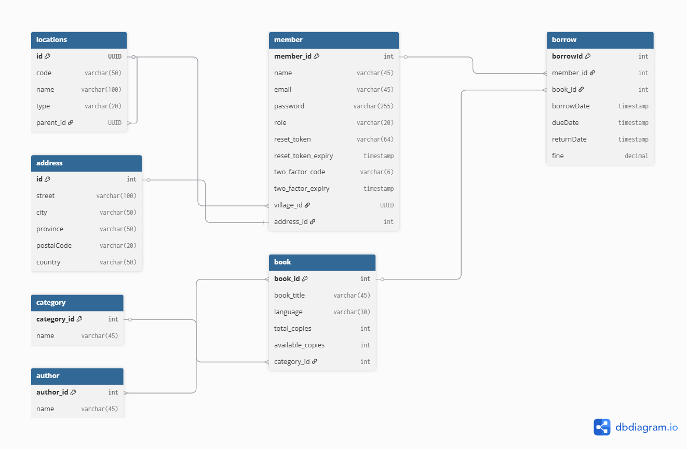

# Library Management System

A comprehensive Spring Boot application for managing library operations with hierarchical location management.

## Entity Relationship Diagram


## Assignment Requirements ✅

This project demonstrates all 8 required features:

1. **✅ ERD with 5+ Tables**: 7 entities (Location, Member, Book, Author, Category, Borrow, Address)
2. **✅ Location Saving**: Hierarchical location management system
3. **✅ Sorting & Pagination**: Implemented for books and members
4. **✅ Many-to-Many Relationships**: Book ↔ Author with join table
5. **✅ One-to-Many Relationships**: Category → Book, Location hierarchy
6. **✅ One-to-One Relationships**: Member ↔ Address
7. **✅ existBy() Methods**: Implemented in repositories (existsByEmail, existsByName, existsByTitleAndAuthors_Authorid)
8. **✅ Province-based Queries**: Query members by province code/name/ID

## Features

### Core Functionality
- **Location Management**: Hierarchical location system (Province → District → Sector → Cell → Village)
- **Member Management**: User registration, authentication with 2FA, password reset
- **Book Management**: CRUD operations with author and category relationships
- **Borrowing System**: Track book borrowing and returns
- **Advanced Queries**: Search members by province, pagination, sorting

### Technical Features
- **Spring Boot 3.x** with Spring Data JPA
- **PostgreSQL** database
- **Email Integration** for 2FA and password reset
- **RESTful APIs** with proper HTTP status codes
- **DTO Pattern** for data transfer
- **Pagination & Sorting** support

## Database Schema

### Entities (7 Tables)
1. **Location** - Hierarchical location structure
2. **Member** - Library members with authentication
3. **Book** - Book catalog
4. **Author** - Book authors
5. **Category** - Book categories
6. **Borrow** - Borrowing records
7. **Address** - Member addresses

### Relationships
- **Many-to-Many**: Book ↔ Author
- **One-to-Many**: Category → Book, Location → Children
- **One-to-One**: Member ↔ Address
- **Many-to-One**: Member → Location (Village)

## API Endpoints

### Location Management
```
POST   /api/locations/save
GET    /api/locations/provinces
GET    /api/locations/districts/{provinceCode}
GET    /api/locations/sectors/{districtCode}
GET    /api/locations/cells/{sectorCode}
GET    /api/locations/villages/{cellCode}
GET    /api/locations/province/{provinceId}/villages
```

### Member Management
```
POST   /api/member/signup
POST   /api/member/login
POST   /api/member/verify-2fa
GET    /api/member/getAllMember
GET    /api/member/paginated
GET    /api/member/by-province/code/{provinceCode}
GET    /api/member/by-province/name/{provinceName}
```

### Book Management
```
POST   /api/book/add
GET    /api/book/all
GET    /api/book/paginated
GET    /api/book/sorted
GET    /api/book/search
```

## Quick Testing Guide

### 1. Test Location Hierarchy (Requirements 2 & 5)
```bash
# Create Province
POST /api/locations/save
{"name": "Kigali City", "code": "11", "type": "PROVINCE"}

# Create District
POST /api/locations/save
{"name": "Gasabo", "code": "1101", "type": "DISTRICT", "parentCode": "11"}

# Test hierarchy
GET /api/locations/provinces
GET /api/locations/districts/11
```

### 2. Test Many-to-Many Relationship (Requirement 4)
```bash
# Create Author
POST /api/author/save
{"authorName": "Frank Herbert"}

# Create Category
POST /api/category/save
{"categoryName": "Science Fiction"}

# Create Book with Author
POST /api/book/add
{"title": "Dune", "authorIds": [1], "category_id": 1, "language": "English", "totalCopies": 5, "availableCopies": 5}
```

### 3. Test Pagination & Sorting (Requirement 3)
```bash
GET /api/book/paginated?page=0&size=5&sortBy=title&direction=asc
GET /api/member/sorted?sortBy=name&direction=desc
```

### 4. Test Province Queries (Requirement 8)
```bash
GET /api/member/by-province/code/11
GET /api/member/by-province/name/Kigali City
```

## Database Configuration

```properties
spring.datasource.url=jdbc:postgresql://localhost:5432/library_db
spring.datasource.username=postgres
spring.datasource.password=123
```

## Technologies Used

- **Spring Boot 3.x**
- **Spring Data JPA**
- **PostgreSQL**
- **Spring Security** (for authentication)
- **JavaMail** (for 2FA)
- **Maven** (build tool)

## Author

**Ange Mireille**  
Midterm Project - Group E  
March 2026

---

**GitHub Repository**: https://github.com/angemireille/midterm_25487_groupE
